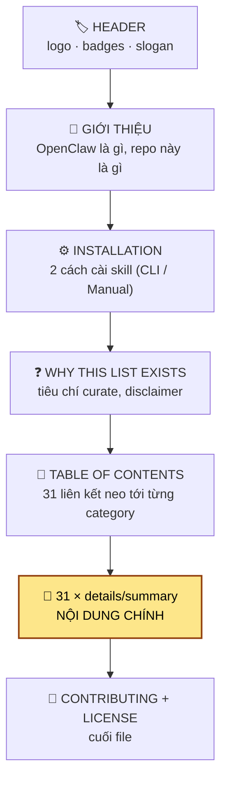
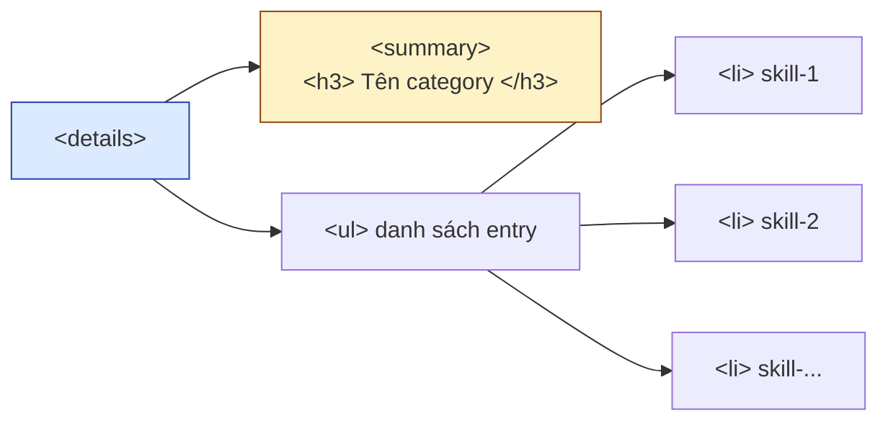
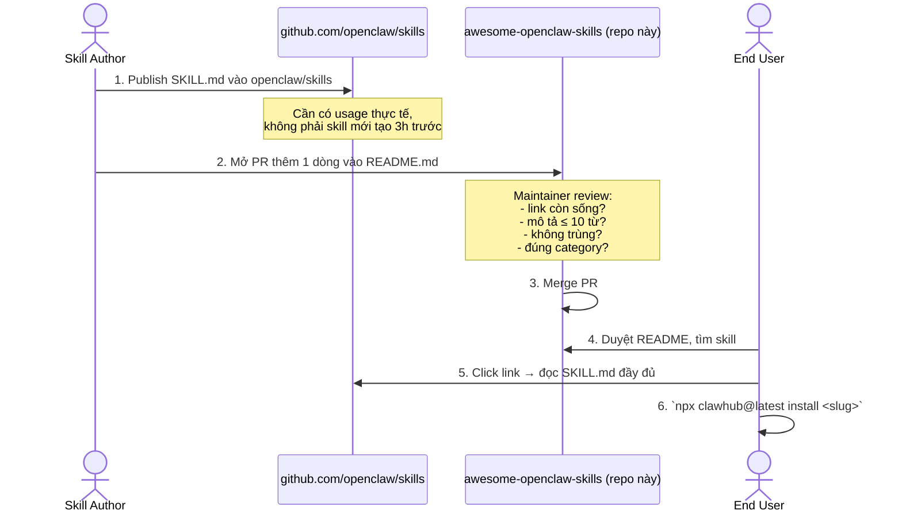

# Giải phẫu repo — Awesome OpenClaw Skills

> Tài liệu này mổ xẻ repo theo 4 lớp: **(1) cây file vật lý**, **(2) kiến trúc logic README**, **(3) hợp đồng dữ liệu của entry**, **(4) thống kê category**.

---

## 1. Cây file vật lý

Repo cực kỳ tối giản — chỉ **3 file gốc** ở root:

```
awesome-openclaw-skills/
├── README.md            ← Trái tim của repo: 1995 dòng, 1715+ entry, 31 category
├── CONTRIBUTING.md      ← Quy tắc đóng góp (57 dòng)
├── LICENSE              ← MIT, © 2026 VoltAgent
└── docs/                ← (Bộ tài liệu tiếng Việt — không tồn tại trong upstream)
    └── vi/
        ├── README.md
        ├── 01-giai-phau-repo.md       ← bạn đang đọc
        ├── 02-huong-dan-trien-khai.md
        ├── 03-quy-trinh-dong-gop.md
        └── mau/
            ├── README.md
            ├── skill-entry.md
            ├── pull-request.md
            ├── issue-bug.md
            ├── issue-skill-removal.md
            └── new-category-proposal.md
```

**Quan sát quan trọng:** repo **không có thư mục `skills/`** và **không lưu code skill**. Đây thuần là kho danh sách — mọi liên kết trỏ ra ngoài tới [openclaw/skills](https://github.com/openclaw/skills/tree/main/skills).

---

## 2. Kiến trúc logic README.md

`README.md` được chia thành 7 vùng cố định. Mỗi vùng phục vụ một mục đích rõ ràng:



### Bảng định vị từng vùng

| Vùng | Dòng | Chức năng | Có thể sửa? |
|---|---|---|---|
| Header (logo, badges) | 1–27 | Marketing, brand VoltAgent | ❌ Maintainer giữ |
| Giới thiệu | 28–37 | Định nghĩa OpenClaw + repo này | ❌ Maintainer giữ |
| Installation | 38–63 | Hướng dẫn cài skill | ❌ Maintainer giữ |
| Why This List Exists | 64–73 | Tiêu chí curate & disclaimer | ❌ Maintainer giữ |
| Table of Contents | 75–115 | Mục lục 31 category | ⚠️ Chỉ sửa khi thêm/đổi tên category |
| **31 × `<details>` block** | **117–1978** | **NƠI THÊM ENTRY MỚI** | ✅ Contributor sửa ở đây |
| Contributing + License | 1980–1995 | Liên kết tới CONTRIBUTING.md | ❌ Maintainer giữ |

> **Ghi nhớ:** 99% PR chỉ chạm vào **vùng `<details>`** — thêm đúng 1 dòng vào cuối category phù hợp.

---

## 3. Hợp đồng dữ liệu của một entry

Mỗi skill trong list là **một dòng markdown** tuân theo công thức cứng:

```markdown
- [skill-name](https://github.com/openclaw/skills/tree/main/skills/<author>/<skill-name>/SKILL.md) - Mô tả ≤ 10 từ.
```

### Mổ xẻ một entry thật

Ví dụ entry `ggshield-scanner` thuộc category *Security & Passwords*:

```
- [ggshield-scanner](https://github.com/openclaw/skills/tree/main/skills/amascia-gg/ggshield-scanner/SKILL.md) - Detect 500+ types of hardcoded secrets (API keys, credentials, tokens) before they leak into git.
│  └── slug           │  └── URL bắt buộc trỏ openclaw/skills/<author>/<slug>/SKILL.md     │ └── mô tả 1 dòng
```

| Thành phần | Quy tắc |
|---|---|
| **Dấu `- `** | Bắt buộc (cú pháp list của Markdown) |
| **`[slug]`** | Trùng tên thư mục skill trong openclaw/skills |
| **URL** | Bắt buộc dạng `github.com/openclaw/skills/tree/main/skills/<author>/<slug>/SKILL.md`. Repo cá nhân/gist/website **KHÔNG được chấp nhận** |
| **`- Mô tả`** | Cách URL bằng ` - ` (space-dash-space), mô tả ≤ 10 từ, không kết bằng dấu chấm bắt buộc nhưng thường có |

### Biến thể: nhiều skill cùng tác giả

Nếu một tác giả có ≥ 2 skill **cùng category**, gom lại bằng cách trỏ tới **thư mục tác giả**:

```markdown
- [author-skills](https://github.com/openclaw/skills/tree/main/skills/<author>) - Tóm tắt chung cho toàn bộ skill của tác giả.
```

Ví dụ thực tế trong repo:

```markdown
- [security-skills](https://github.com/openclaw/skills/tree/main/skills/chandrasekar-r) - Security audit and real-time monitoring for Clawdbot deployments.
```

---

## 4. Bản đồ 31 category

Số trong ngoặc là **số entry đếm thực** từ `README.md` (có thể chênh nhẹ với mục lục do entry mới được thêm).

### Top 10 category theo kích thước

```
AI & LLMs                  ███████████████████████████  159
Search & Research          ███████████████████████████  145
DevOps & Cloud             ██████████████████████████   143
Clawdbot Tools             ████████████████████         105
Marketing & Sales          █████████████████             92
Productivity & Tasks       █████████████████             92
CLI Utilities              █████████████████             88
Browser & Automation       █████████████                 69
Notes & PKM                ████████████                  62
Communication              ███████████                   58
```

### Bảng đầy đủ 31 category

| # | Category | Số entry | Mặc định mở? |
|---|---|---:|:---:|
| 1 | Web & Frontend Development | 46 | ✅ open |
| 2 | Coding Agents & IDEs | 55 | ✅ open |
| 3 | Git & GitHub | 34 | ✅ open |
| 4 | Moltbook | 27 | ❌ closed |
| 5 | DevOps & Cloud | 143 | ❌ closed |
| 6 | Browser & Automation | 69 | ❌ closed |
| 7 | Image & Video Generation | 38 | ❌ closed |
| 8 | Apple Apps & Services | 32 | ❌ closed |
| 9 | Search & Research | 145 | ❌ closed |
| 10 | Clawdbot Tools | 105 | ❌ closed |
| 11 | CLI Utilities | 88 | ❌ closed |
| 12 | Marketing & Sales | 92 | ❌ closed |
| 13 | Productivity & Tasks | 92 | ❌ closed |
| 14 | AI & LLMs | 159 | ❌ closed |
| 15 | Data & Analytics | 17 | ❌ closed |
| 16 | Finance | 22 | ❌ closed |
| 17 | Media & Streaming | 40 | ❌ closed |
| 18 | Notes & PKM | 62 | ❌ closed |
| 19 | iOS & macOS Development | 14 | ❌ closed |
| 20 | Transportation | 56 | ❌ closed |
| 21 | Personal Development | 38 | ❌ closed |
| 22 | Health & Fitness | 35 | ❌ closed |
| 23 | Communication | 58 | ❌ closed |
| 24 | Speech & Transcription | 44 | ❌ closed |
| 25 | Smart Home & IoT | 50 | ❌ closed |
| 26 | Shopping & E-commerce | 34 | ❌ closed |
| 27 | Calendar & Scheduling | 28 | ❌ closed |
| 28 | PDF & Documents | 35 | ❌ closed |
| 29 | Self-Hosted & Automation | 16 | ❌ closed |
| 30 | Security & Passwords | 21 | ❌ closed |
| 31 | Gaming | 7 | ❌ closed |

**Ghi chú:** 3 category đầu (`Web & Frontend`, `Coding Agents & IDEs`, `Git & GitHub`) dùng `<details open>` để mở mặc định khi xem trên GitHub — đây là những nhóm "showcase" để khách truy cập nhìn thấy ngay.

---

## 5. Cấu trúc một block category

Mỗi category là một block HTML `<details>` lồng trong markdown — đây là cú pháp cho phép GitHub render khối **mở/đóng**:

```markdown
<details>
<summary><h3 style="display:inline">Tên Category</h3></summary>

- [skill-1](https://...) - Mô tả.
- [skill-2](https://...) - Mô tả.
- [skill-3](https://...) - Mô tả.

</details>
```

### Sơ đồ DOM khi render



> **Lưu ý kỹ thuật:** Phải có **dòng trống** trước danh sách bên trong `<details>`, nếu không Markdown sẽ không render block list.

---

## 6. Sơ đồ dòng dữ liệu

Khi một skill xuất hiện trong list này, nó đi qua đường ống sau:



**Kết luận:** repo này là **lớp curate đứng trước** registry chính. Mọi giá trị của repo nằm ở việc *chọn lọc + phân loại*, không phải ở việc lưu trữ code.

---

## 7. Tiêu chí curate (rút gọn)

Theo `CONTRIBUTING.md` + phần "Why This List Exists" trong README:

```
✅ Được chấp nhận                          ❌ Bị loại
─────────────────────────                  ─────────────────────────
• Skill đã có ở openclaw/skills            • Skill ở repo cá nhân / gist
• Có SKILL.md đầy đủ                       • Skill mới tạo, chưa có usage
• Mô tả ≤ 10 từ                            • Mô tả dài, marketing-y
• Đã có cộng đồng dùng                     • Crypto / blockchain / DeFi / finance
• Tiếng Anh                                • Spam / sinh hàng loạt
• Không trùng skill đã có                  • Trùng nội dung skill khác
• Không phải nội dung độc hại              • Lừa đảo, bypass, abuse
```

---

## 8. Checklist cho người mới đọc repo

Tick xong checklist này là bạn hiểu repo:

- [ ] Mình biết repo chỉ có **3 file gốc** và **không có code skill**
- [ ] Mình biết **README.md là sản phẩm chính** — mọi nội dung sống ở đó
- [ ] Mình biết **31 category** đều nằm trong block `<details>`
- [ ] Mình biết entry phải trỏ về **openclaw/skills** — không chấp nhận repo cá nhân
- [ ] Mình biết mô tả phải **≤ 10 từ**
- [ ] Mình biết quy tắc gom skill cùng tác giả vào **link thư mục**
- [ ] Mình biết có 3 category mặc định `<details open>` (Web, Coding Agents, Git)

→ Bước tiếp: đọc [Hướng dẫn triển khai chi tiết](02-huong-dan-trien-khai.md) để thực hành thêm skill mới.
