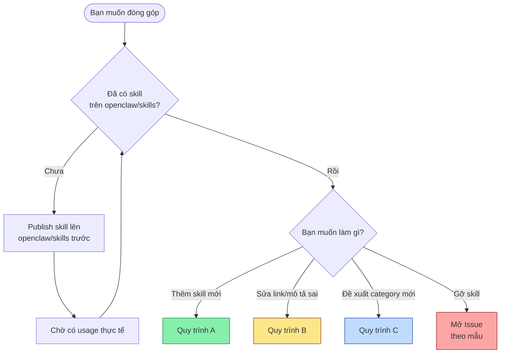
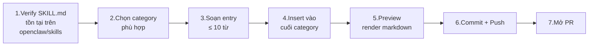
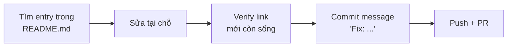
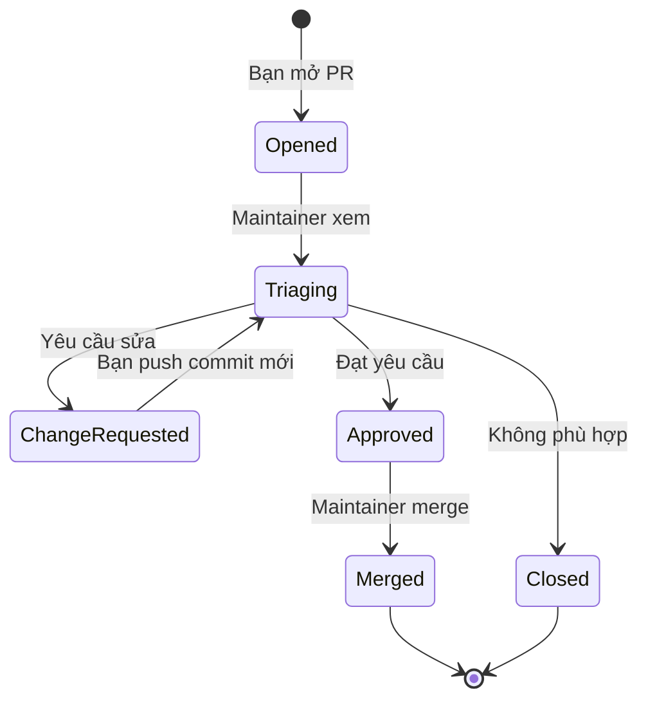

# Hướng dẫn triển khai chi tiết

> Tài liệu này hướng dẫn **end-to-end** việc đóng góp vào repo `awesome-openclaw-skills` — từ lúc clone về máy cho tới khi PR được merge.

---

## Mục lục

1. [Hai tình huống đóng góp phổ biến](#1-hai-tình-huống-đóng-góp-phổ-biến)
2. [Chuẩn bị môi trường](#2-chuẩn-bị-môi-trường)
3. [Quy trình A — Thêm skill mới](#3-quy-trình-a--thêm-skill-mới)
4. [Quy trình B — Sửa entry cũ](#4-quy-trình-b--sửa-entry-cũ)
5. [Quy trình C — Đề xuất category mới](#5-quy-trình-c--đề-xuất-category-mới)
6. [Kiểm thử trước khi gửi PR](#6-kiểm-thử-trước-khi-gửi-pr)
7. [Gửi PR & vòng review](#7-gửi-pr--vòng-review)
8. [FAQ / Lỗi thường gặp](#8-faq--lỗi-thường-gặp)

---

## 1. Hai tình huống đóng góp phổ biến



---

## 2. Chuẩn bị môi trường

### Yêu cầu

| Công cụ | Mục đích | Bắt buộc? |
|---|---|---|
| `git` | Quản lý source code | ✅ |
| Tài khoản GitHub | Fork + PR | ✅ |
| Editor markdown bất kỳ (VS Code, vim…) | Sửa README | ✅ |
| `curl` hoặc trình duyệt | Kiểm link `SKILL.md` còn sống | ✅ |
| `markdownlint` (tuỳ chọn) | Lint markdown trước khi PR | ⭕ |

### Setup local

```bash
# 1. Fork repo trên GitHub UI: VoltAgent/awesome-openclaw-skills → <bạn>/awesome-openclaw-skills

# 2. Clone bản fork
git clone https://github.com/<bạn>/awesome-openclaw-skills.git
cd awesome-openclaw-skills

# 3. Thêm upstream để đồng bộ về sau
git remote add upstream https://github.com/VoltAgent/awesome-openclaw-skills.git
git fetch upstream

# 4. Tạo branch riêng cho mỗi đóng góp — KHÔNG sửa thẳng vào main
git checkout -b add-skill-<author>-<skill-slug>
```

> **Quy ước branch:** đặt tên branch phản ánh đúng việc bạn làm.
> - Thêm: `add-skill-<author>-<slug>`
> - Sửa: `fix-skill-<slug>` hoặc `fix-link-<slug>`
> - Gỡ: `remove-skill-<slug>`
> - Category mới: `propose-category-<tên>`

---

## 3. Quy trình A — Thêm skill mới

### Sơ đồ tổng quát



### Bước 1 — Verify skill đã publish

Truy cập URL theo công thức:
```
https://github.com/openclaw/skills/tree/main/skills/<author>/<skill-slug>/SKILL.md
```

Nếu trả 404 → **dừng lại**, bạn cần publish skill vào `openclaw/skills` trước.

> **Trick kiểm nhanh từ terminal:**
> ```bash
> curl -sIL -o /dev/null -w "%{http_code}\n" \
>   https://github.com/openclaw/skills/tree/main/skills/<author>/<slug>/SKILL.md
> # 200 → OK   ·   404 → chưa publish
> ```

### Bước 2 — Chọn category

Tham khảo [bảng 31 category trong tài liệu Giải phẫu](01-giai-phau-repo.md#bảng-đầy-đủ-31-category).

**Nguyên tắc chọn:**

| Skill làm gì? | Category gợi ý |
|---|---|
| Tích hợp API LLM / agent framework | `AI & LLMs` |
| Wrap CLI tool, tự động hoá shell | `CLI Utilities` |
| UI React/Vue/HTML, design system | `Web & Frontend Development` |
| Triage GitHub PR/issue, workflow CI | `Git & GitHub` |
| Browser automation (Playwright, Stagehand…) | `Browser & Automation` |
| Note-taking, Obsidian, Notion | `Notes & PKM` |
| TTS / STT / Whisper | `Speech & Transcription` |
| HomeAssistant, MQTT, Zigbee | `Smart Home & IoT` |
| OCR, PDF parse, document tools | `PDF & Documents` |

Nếu không khớp category nào → ghi đề xuất vào PR description, maintainer sẽ quyết định.

### Bước 3 — Soạn entry

Theo [hợp đồng entry](01-giai-phau-repo.md#3-hợp-đồng-dữ-liệu-của-một-entry):

```markdown
- [<slug>](https://github.com/openclaw/skills/tree/main/skills/<author>/<slug>/SKILL.md) - <Mô tả ≤ 10 từ>.
```

**Tips viết mô tả tốt:**

| ✅ Tốt | ❌ Tệ |
|---|---|
| `Send emails via SMTP with HTML and attachments.` | `An awesome skill for sending email that supports many different protocols and features!` |
| `Profanity detection with leetspeak and Unicode homoglyphs.` | `The best ever profanity detection library in the world.` |
| `Headless video rendering with Remotion.` | `Use this skill to render videos.` |

**Quy tắc:** Mô tả **mô tả chức năng**, không phải quảng cáo. Bắt đầu bằng **động từ** hoặc **danh từ kỹ thuật**.

### Bước 4 — Insert vào cuối category

Mở `README.md`, tìm category bằng phím tắt search (`/`), tới **dòng cuối cùng có entry** trong block `<details>`, **thêm dòng mới ngay sau đó** (trước dòng trống và `</details>`).

#### Trường hợp đặc biệt: gom skill cùng tác giả

Nếu bạn đã có 1+ skill trong cùng category, **đừng** thêm dòng mới. Hãy đổi entry hiện có thành link cấp tác giả:

**Trước:**
```markdown
- [my-tool-a](https://github.com/openclaw/skills/tree/main/skills/me/my-tool-a/SKILL.md) - Tool A description.
```

**Sau khi thêm skill thứ 2:**
```markdown
- [me-skills](https://github.com/openclaw/skills/tree/main/skills/me) - Tóm tắt chung cho cả Tool A và Tool B.
```

### Bước 5 — Preview render

GitHub render `<details>` block đúng cách chỉ khi:

1. Có **dòng trống** ngay sau dòng `</summary>` và trước dòng đầu tiên của list.
2. Có **dòng trống** trước `</details>`.

Cú pháp đúng:

```markdown
<details>
<summary><h3 style="display:inline">My Category</h3></summary>

- [skill-1](...) - Desc.
- [skill-2](...) - Desc.

</details>
```

**Preview cục bộ** bằng VS Code: bấm `Cmd/Ctrl + Shift + V` trong khi mở `README.md`.

### Bước 6 — Commit + Push

```bash
git add README.md
git commit -m "Add skill: <author>/<skill-slug>"
git push origin add-skill-<author>-<skill-slug>
```

> Format commit tuân theo PR title quy ước: `Add skill: <author>/<skill-slug>` (xem [CONTRIBUTING.md](../../CONTRIBUTING.md#pr-title)).

### Bước 7 — Mở PR

Sang GitHub UI → "Compare & pull request" → dùng [mẫu PR](mau/pull-request.md).

---

## 4. Quy trình B — Sửa entry cũ

Khi nào dùng:
- Link `SKILL.md` đã đổi (404).
- Mô tả sai chức năng / quá dài.
- Sửa typo.

### Các bước



**Branch + commit:**
```bash
git checkout -b fix-skill-<slug>
# sửa README.md
git commit -m "Fix: <slug> description / broken link"
```

**PR title:** `Fix: <slug> description` hoặc `Fix: broken link for <slug>`.

---

## 5. Quy trình C — Đề xuất category mới

Đây là thay đổi **lớn nhất** ảnh hưởng Table of Contents. Khuyến nghị:

1. **Mở issue trước** dùng [mẫu category mới](mau/new-category-proposal.md).
2. Chờ maintainer ack (ít nhất 1 reaction 👍 hoặc comment chấp thuận).
3. Mới mở PR.

### Khi PR đã được ack

Phải sửa **đồng thời 2 chỗ** trong `README.md`:

#### Chỗ 1 — Table of Contents (dòng ~75)

Thêm vào danh sách:
```markdown
- [Tên Category](#tên-category) (số_entry_khởi_tạo)
```

Slug anchor: chữ thường, dấu cách → `-`, ký tự `&` → `--` (double dash), bỏ ký tự đặc biệt khác.

> Ví dụ: `Smart Home & IoT` → `#smart-home--iot`

#### Chỗ 2 — Block category (cuối file, trước `## 🤝 Contributing`)

```markdown
<details>
<summary><h3 style="display:inline">Tên Category</h3></summary>

- [skill-đầu-tiên](https://github.com/openclaw/skills/...) - Mô tả.

</details>
```

---

## 6. Kiểm thử trước khi gửi PR

Checklist tự kiểm:

```
☐ Link mới mở được, trả HTTP 200
☐ Slug entry trùng tên thư mục trong openclaw/skills
☐ Mô tả ≤ 10 từ, tiếng Anh, không quảng cáo
☐ Đặt đúng cuối category, không xen vào giữa
☐ Có dòng trống trước list trong <details>
☐ Không tạo entry trùng với entry đã có (grep slug)
☐ Branch đặt tên theo quy ước
☐ Commit message theo format "Add skill: ..." / "Fix: ..."
```

### Lệnh kiểm trùng nhanh

```bash
# Có entry nào đã tồn tại với slug này chưa?
grep -F "/<slug>/SKILL.md" README.md
# rỗng → an toàn   ·   có dòng → trùng
```

### Lệnh kiểm dòng quá dài (tránh mô tả lan man)

```bash
# In các entry dài quá ~200 ký tự để soát
awk '/^- \[/ && length($0) > 200' README.md
```

---

## 7. Gửi PR & vòng review

### Vòng đời PR



### Tiêu chí maintainer thường check

1. **Link sống** — `curl -I` trả 200.
2. **Đúng vị trí** — entry nằm trong category phù hợp, cuối block.
3. **Không trùng** — grep slug → 1 dòng duy nhất.
4. **Mô tả ≤ 10 từ** + không quảng cáo.
5. **Slug khớp openclaw/skills** — không tự đổi tên skill.
6. **Không phải skill bị cấm** — không crypto/DeFi/blockchain/finance.
7. **Có usage thực tế** — skill mới tinh, chưa ai dùng → từ chối.

### Thời gian phản hồi

Repo không cam kết SLA chính thức. Quan sát thực tế: PR đơn giản (1 dòng) thường được review trong vài ngày tới 1-2 tuần.

> **Tránh ping spam.** Không cần comment "any update?" liên tục. Nếu sau 3 tuần không có phản hồi, có thể nhẹ nhàng `@VoltAgent-team` (kiểm tên tổ chức trong commit history) 1 lần.

---

## 8. FAQ / Lỗi thường gặp

### Q1. Tôi vừa publish skill 2 ngày trước, đã có 5 sao. PR có được chấp nhận không?

> Không. CONTRIBUTING ghi rõ: "Brand new skills are not accepted — give your skill time to mature and gain users". Hãy chờ vài tuần và có usage thực tế.

### Q2. Tôi muốn thêm skill blockchain swap token, có được không?

> Không. Crypto/blockchain/DeFi/finance đều không được chấp nhận.

### Q3. Skill của tôi liên quan tới ngân hàng cá nhân (track expense) — có tính là "finance" bị cấm không?

> Tuỳ ngữ cảnh — finance app cá nhân nhẹ thường rơi vào *Productivity & Tasks*. Trade/đầu tư/crypto là cái bị cấm. Nếu mơ hồ, mở issue hỏi maintainer trước khi PR.

### Q4. Bao nhiêu skill cùng tác giả thì phải gom?

> Theo CONTRIBUTING: nếu một tác giả có **multiple skills in the same area** thì phải link tới folder cha. Nguyên tắc cá nhân: từ **2 skill trong cùng category** là gom.

### Q5. `<details open>` vs `<details>` — tôi tự ý đổi được không?

> Không nên. 3 category đầu (Web/Coding/Git) `open` mặc định là chọn lựa của maintainer cho mục đích showcase. Đừng tự đổi.

### Q6. Mô tả tôi viết 11 từ, có sao không?

> Hơi chặt nhưng quy tắc là **≤ 10**. Hãy rút gọn. Mô tả ngắn buộc bạn viết rõ chức năng cốt lõi.

### Q7. Có CI/test nào kiểm tự động không?

> Không (tại thời điểm viết tài liệu này). Mọi kiểm tra là **review thủ công**. Vì vậy tự kiểm trước khi gửi.

### Q8. Link của tôi trỏ vào subfolder cụ thể (không phải `/SKILL.md`) có được không?

> Theo CONTRIBUTING, format chuẩn là `.../SKILL.md`. Trừ khi gom-tác-giả thì trỏ folder tác giả (không có `/SKILL.md`).

---

## Phụ lục — Cheat sheet 1 trang

```
─── ADD SKILL ──────────────────────────────────────────────
1. git checkout -b add-skill-<author>-<slug>
2. Mở README.md, search category, nhảy xuống cuối block
3. Thêm:  - [slug](URL_SKILL.md) - Mô tả ≤10 từ.
4. git commit -m "Add skill: <author>/<slug>"
5. git push -u origin add-skill-<author>-<slug>
6. Mở PR — copy mẫu mau/pull-request.md

─── FIX ENTRY ─────────────────────────────────────────────
1. git checkout -b fix-skill-<slug>
2. Sửa entry tại chỗ
3. git commit -m "Fix: <slug> ..."
4. PR title: "Fix: <slug> ..."

─── NEW CATEGORY ──────────────────────────────────────────
1. Mở issue trước (mẫu mau/new-category-proposal.md)
2. Chờ ack
3. Sửa Table of Contents + thêm block <details> mới
4. PR

─── DON'T ─────────────────────────────────────────────────
✗ Link tới repo cá nhân / gist
✗ Skill mới publish, chưa có usage
✗ Crypto / blockchain / DeFi / finance
✗ Mô tả > 10 từ, marketing
✗ Trùng skill đã có
✗ Push thẳng main
```

→ Bước kế: đọc [Quy trình đóng góp](03-quy-trinh-dong-gop.md) để hiểu vai trò maintainer.
