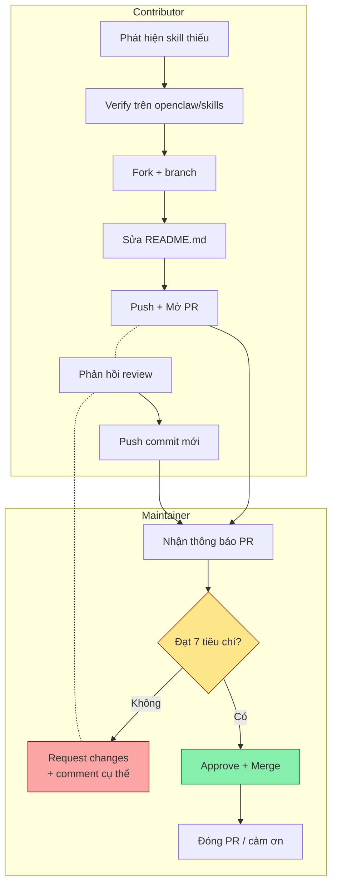
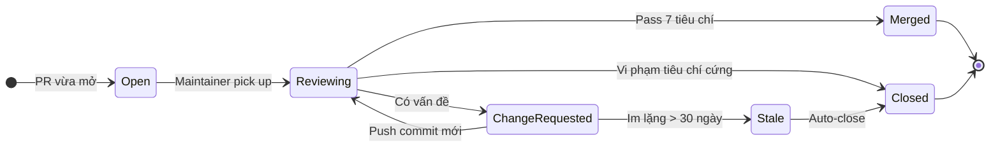
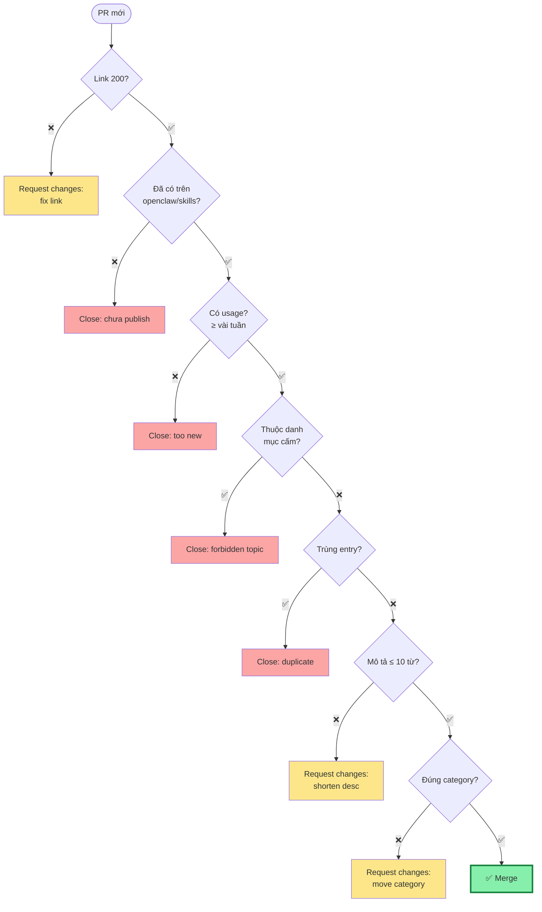

# Quy trình đóng góp end-to-end

> Tài liệu này mô tả flow đầy đủ giữa **contributor** và **maintainer**, kèm tiêu chí ra quyết định ở từng bước.

---

## 1. Sơ đồ swimlane tổng quát



---

## 2. 7 tiêu chí maintainer dùng để duyệt PR

| # | Tiêu chí | Cách kiểm | Hành động nếu fail |
|---|---|---|---|
| 1 | Link `SKILL.md` trả 200 | Click thử hoặc `curl -I` | Request changes + chỉ đúng link |
| 2 | Slug trùng folder trong openclaw/skills | Visual compare | Request changes |
| 3 | Đúng category | Đối chiếu mô tả ↔ bảng category | Đề xuất category khác |
| 4 | Mô tả ≤ 10 từ, không quảng cáo | Đếm từ | Request rút gọn |
| 5 | Không trùng entry đã có | `grep -F "/<slug>/SKILL.md" README.md` | Đóng PR là duplicate |
| 6 | Không thuộc danh mục cấm | Đọc SKILL.md gốc | Đóng PR + giải thích |
| 7 | Có usage thực tế | Xem star/fork/issue ở openclaw/skills | Đóng PR + đề nghị chờ |

---

## 3. Vòng đời 4 trạng thái của PR



---

## 4. Cây quyết định cho maintainer



**Quy ước màu:**
- 🟢 Xanh: merge
- 🟡 Vàng: request changes (PR có thể cứu)
- 🔴 Đỏ: close (PR không cứu được)

---

## 5. Vai trò 3 loại người tham gia

### 5.1. Skill Author (tác giả skill)

| Trách nhiệm | Không phải trách nhiệm |
|---|---|
| Publish skill lên openclaw/skills | Maintain repo `awesome-openclaw-skills` |
| Viết SKILL.md đầy đủ | Quyết định category nào "đúng" |
| Cập nhật link khi đổi slug | Review PR người khác |

### 5.2. Contributor (người gửi PR vào repo này)

| Trách nhiệm | Không phải trách nhiệm |
|---|---|
| Tự verify link còn sống | Audit security skill |
| Đặt entry đúng category | Bảo trì code skill upstream |
| Phản hồi review trong 7 ngày | Trả lời các PR khác |
| Tuân thủ format entry | Quyết định category mới |

### 5.3. Maintainer

| Trách nhiệm | Không phải trách nhiệm |
|---|---|
| Áp dụng 7 tiêu chí khi review | Sửa skill cho tác giả |
| Quyết định category mới | Hỗ trợ cài đặt skill cá nhân |
| Định kỳ scan link hỏng | Đảm bảo skill an toàn (chỉ "best effort") |
| Đóng PR vi phạm tiêu chí | Audit security mọi skill được list |

---

## 6. Quy ước nhãn issue/PR (đề xuất)

Repo upstream chưa có label chính thức. Khi cần phân loại, có thể dùng:

| Label đề xuất | Khi nào dùng |
|---|---|
| `add-skill` | PR thêm 1+ skill |
| `fix-link` | PR sửa link hỏng |
| `fix-description` | PR sửa mô tả |
| `category-proposal` | Issue/PR đề xuất category mới |
| `remove-skill` | Issue/PR đề nghị gỡ skill |
| `duplicate` | Đã có entry tương đương |
| `needs-publish-first` | Skill chưa lên openclaw/skills |
| `forbidden-topic` | Crypto/DeFi/blockchain/finance |
| `too-new` | Skill mới publish, chưa có usage |

---

## 7. Bảo trì định kỳ

Vì repo phụ thuộc vào liên kết bên ngoài (openclaw/skills), maintainer nên định kỳ:

```mermaid
gantt
    title Lịch bảo trì đề xuất
    dateFormat YYYY-MM-DD
    section Hàng tháng
    Scan link hỏng         :a1, 2026-01-01, 1d
    Đếm số entry/category   :a2, 2026-01-15, 1d
    section Hàng quý
    Review category lớn quá  :b1, 2026-01-01, 7d
    (>200 entry → tách)
    section 6 tháng
    Audit "forbidden topic" :c1, 2026-03-01, 14d
    sót lại trong list
```

### Script scan link hỏng (tham khảo)

```bash
#!/usr/bin/env bash
# scan-broken-links.sh — liệt kê entry trỏ tới URL không trả 200
set -euo pipefail

grep -oE 'https://github\.com/openclaw/skills[^)]+' README.md \
  | sort -u \
  | while read -r url; do
      code=$(curl -sIL -o /dev/null -w '%{http_code}' --max-time 8 "$url" || echo "ERR")
      if [[ "$code" != "200" ]]; then
        echo "$code $url"
      fi
    done
```

> Chạy: `bash scan-broken-links.sh > broken.txt` — phần lớn entry chạy ~vài phút, có thể song song bằng `xargs -P 16`.

---

## 8. Khi mọi thứ đi sai

| Sự cố | Triage |
|---|---|
| Merge nhầm 1 entry trùng | Mở PR revert ngay, ghi rõ "dedup" |
| Đặt sai category, đã merge | Mở PR sửa nhỏ "Move <slug> to <new category>" |
| Skill upstream bị xoá khỏi openclaw/skills | Mở issue "Remove <slug>" rồi PR gỡ |
| Tác giả đổi slug folder | PR fix link, giữ nguyên vị trí |
| Tranh cãi category | Mở issue thảo luận trước, không revert war |

---

## 9. Tóm tắt 1 dòng cho từng vai trò

```
Skill Author    → "Publish trước. Đợi vài tuần. Mới gửi PR."
Contributor     → "1 dòng đúng format. Đúng category. ≤ 10 từ."
Maintainer      → "Áp 7 tiêu chí. Không review thay tác giả viết SKILL.md."
```

→ Xem tiếp [Bộ mẫu tài liệu](mau/README.md) để có template thực dụng.
