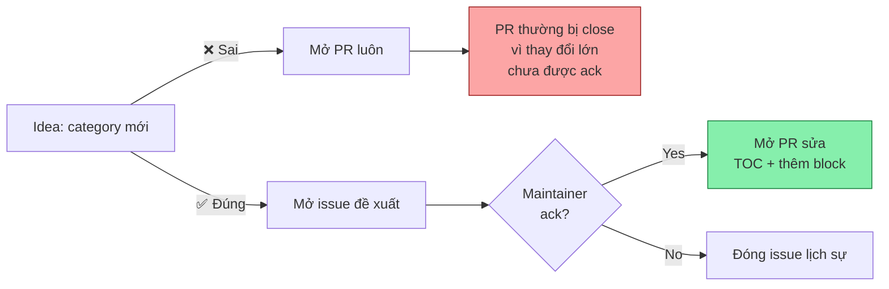

# Mẫu — Đề xuất category mới

> Dùng khi bạn nghĩ một nhóm skill đủ lớn để tách thành category riêng (ít nhất **5 skill** đã tồn tại trong list hoặc chuẩn bị thêm). **Luôn mở issue trước**, đợi maintainer ack, mới mở PR.

---

## Vì sao phải mở issue trước?



Category mới ảnh hưởng:
1. **Table of Contents** (vị trí cố định).
2. **Mặc định `<details open>` hay không** (chính sách showcase).
3. **Có thể overlap** với category hiện có → cần đánh giá.

→ Vì vậy quyết định kiến trúc thuộc về maintainer.

---

## Title issue

```
[Category Proposal] <Tên Category đề xuất>
```

Ví dụ:
- `[Category Proposal] Robotics & Embedded`
- `[Category Proposal] Healthcare APIs`

---

## Body issue

```markdown
## Tên category đề xuất
**<Tên Category>**

## Vì sao cần tách category này?

<2-4 câu trả lời:>
- Hiện đang nằm rải ở category nào?
- Vì sao gom lại sẽ giúp người dùng tìm dễ hơn?
- Có đặc thù nào khiến nó KHÔNG khớp các category sẵn có?

## Phạm vi (in/out)

### ✅ In scope
- <Loại skill 1>
- <Loại skill 2>
- <Loại skill 3>

### ❌ Out of scope
- <Loại skill bị nhầm 1> → vẫn ở category cũ
- <Loại skill bị nhầm 2>

## Skill mẫu (≥ 5) — bằng chứng category có khối lượng

Liệt kê skill đã tồn tại trong list hoặc đã publish trên openclaw/skills mà bạn muốn gom vào category mới:

1. `<slug-1>` — hiện ở `<category cũ>` → mô tả ngắn
2. `<slug-2>` — hiện ở `<category cũ>` → mô tả ngắn
3. `<slug-3>` — hiện ở `<category cũ>` → mô tả ngắn
4. `<slug-4>` — hiện ở `<category cũ>` → mô tả ngắn
5. `<slug-5>` — hiện ở `<category cũ>` → mô tả ngắn

## Vị trí đề xuất trong Table of Contents

<Đặt giữa category nào và category nào? Vì sao?>

Ví dụ: "Đặt giữa `Smart Home & IoT` và `Shopping & E-commerce` vì là chủ đề thiết bị/phần cứng."

## Mặc định `<details open>` hay không?

- [ ] Mặc định mở (open) — chỉ dùng nếu category này nên là showcase
- [x] Mặc định đóng (closed) — phần lớn category dùng cấu hình này

## Câu hỏi mở
<Có vùng xám nào với category hiện có không? Bạn muốn maintainer cho ý kiến gì?>
```

---

## Ví dụ hoàn chỉnh

### Title

```
[Category Proposal] Robotics & Embedded
```

### Body

```markdown
## Tên category đề xuất
**Robotics & Embedded**

## Vì sao cần tách category này?

Hiện skill về robot, MCU, firmware đang nằm rải:
- 3 skill ROS đang ở `DevOps & Cloud`
- 2 skill ESP32/Arduino ở `Smart Home & IoT`
- 1 skill về drone ở `CLI Utilities`

Người tìm skill robotics phải duyệt 3 category mới thấy hết. Gom lại giúp:
1. Người làm robot tìm 1 chỗ.
2. Smart Home gọn hơn, chỉ giữ home automation đúng nghĩa.

## Phạm vi (in/out)

### ✅ In scope
- ROS / ROS2 wrapper
- MCU firmware (ESP32, Arduino, RP2040)
- Robot simulators (Gazebo, Webots)
- Drone control (PX4, ArduPilot)

### ❌ Out of scope
- Home automation thuần (Zigbee/Z-Wave smart bulb) → vẫn ở `Smart Home & IoT`
- IoT cloud (AWS IoT) → vẫn ở `DevOps & Cloud`

## Skill mẫu (≥ 5)

1. `ros2-control` — hiện ở `DevOps & Cloud` → ROS2 lifecycle management
2. `gazebo-sim` — hiện ở `DevOps & Cloud` → Gazebo simulation control
3. `esp32-flasher` — hiện ở `Smart Home & IoT` → ESP32 OTA firmware flash
4. `arduino-cli-wrap` — hiện ở `CLI Utilities` → Arduino CLI automation
5. `px4-control` — chưa có trong list → drone autopilot via MAVLink

## Vị trí đề xuất

Đặt giữa `Smart Home & IoT` (#25) và `Shopping & E-commerce` (#26) — cùng nhóm "phần cứng".

## Mặc định `<details>` mới
- [x] Closed — chưa đủ lớn để showcase

## Câu hỏi mở
- Nên đặt tên là "Robotics & Embedded" hay "Hardware & Robotics"? Em nghiêng phương án đầu vì các skill MCU pure không phải robot vẫn fit.
```

---

## Sau khi issue được ack

PR theo [pull-request.md mục 3](pull-request.md#3-pr-đề-xuất-category-mới-sau-khi-issue-đã-được-ack):

1. Sửa TOC (mục lục `## Table of Contents`).
2. Thêm block `<details>` mới ở vị trí đã thoả thuận.
3. **Di chuyển** các skill mẫu từ category cũ sang category mới (không tạo trùng).
4. PR title: `Add category: <Tên Category>`.

---

## Bảng kiểm trước khi gửi issue

```
☐ Có ≥ 5 skill mẫu đủ justify category
☐ Đã verify các skill mẫu thực sự đang ở category cũ nào
☐ Đã liệt kê rõ in/out scope (tránh overlap)
☐ Đã đề xuất vị trí cụ thể trong TOC
☐ Đã quyết định trạng thái <details open> / closed
☐ Đã grep issue cũ — không trùng đề xuất trước đó
```
